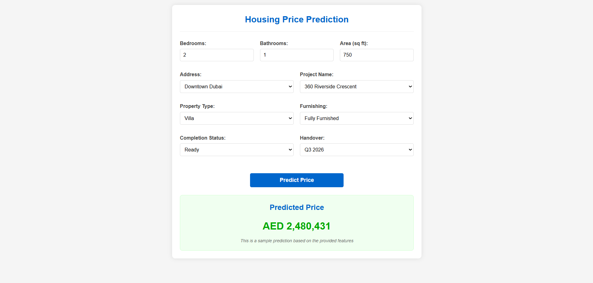
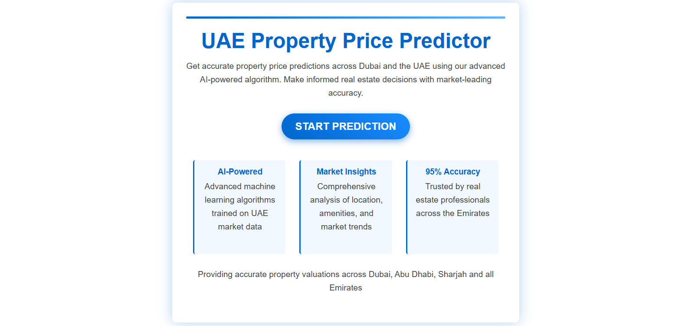

# 🏙️ UAE Housing Price Prediction

This project is a web-based machine learning application that predicts housing prices in the UAE based on user inputs such as location, area, number of bedrooms/bathrooms, property type, and other key features.

Built using **Flask**, **HTML/CSS**, and a trained **machine learning model**, it demonstrates an end-to-end pipeline from data preprocessing to deployment.

---

## 📌 Features

- 🏠 Predict property prices using a trained regression model.
- 🌍 Input fields include address, project name, area, number of bedrooms & bathrooms, furnishing, completion status, and more.
- 📈 Clean, responsive UI for user-friendly interaction.
- 🧠 ML pipeline for feature engineering, transformation, and prediction.

---

---

## 🧑‍💻Working Workflow:

1. constants
2. config_entity
3. artifact_entity
4. components
5. pipeline

---

---

## 🛠️ Tech Stack

| Layer       | Technology            |
| ----------- | --------------------- |
| Backend     | Python, Flask         |
| Frontend    | HTML, CSS             |
| ML Pipeline | scikit-learn, pandas  |
| Deployment  | Flask app (local/dev) |

---

---

## 🚀 How to Run Locally

1. **Clone the Repository**

```bash
git clone https://github.com/Coolsajan/uae-housing-price-predicition.git
cd uae-price-prediction
```

2. **Create & Activate a Virtual Environment**

```bash
python -m venv venv
source venv/bin/activate  # On Windows: venv\Scripts\activate
```

3. **Install Requirements**

```bash
pip install -r requirements.txt
```

4. **Run the Flask App**

```bash
python app.py
```

5. **Access the App**  
   Visit `http://127.0.0.1:5000` in your browser.

---

## ✨ Sample Prediction Screenshot

## 

## 📊 Model Info

The model was trained on recent UAE real estate listings, including features like:

- Address and project name
- Area (sq ft), bedrooms, bathrooms
- Furnishing status, completion status
- Future handover dates

The pipeline includes data imputation, feature transformation (OneHot, Scaling), and a regression model (e.g., RandomForestRegressor).

---

## 📮 Future Improvements

- Model performance monitoring and updates
- Cloud deployment (Heroku/AWS/GCP)
- User authentication
- Add property image uploads

---

## 👨‍💻 Author

- **Your Name**
- 📧 tsajan001@gmail.com
- 🌐 [LinkedIn](https://www.linkedin.com/in/sabu-sajanthapa/)

---

## 📝 License

This project is licensed under the [MIT License](LICENSE).
